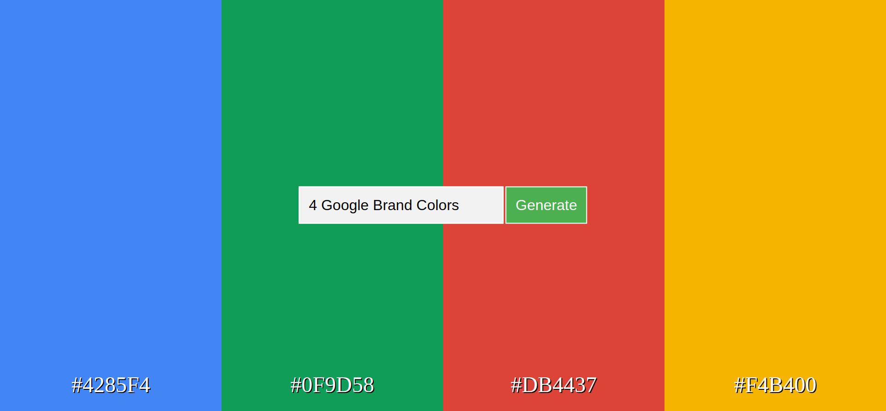
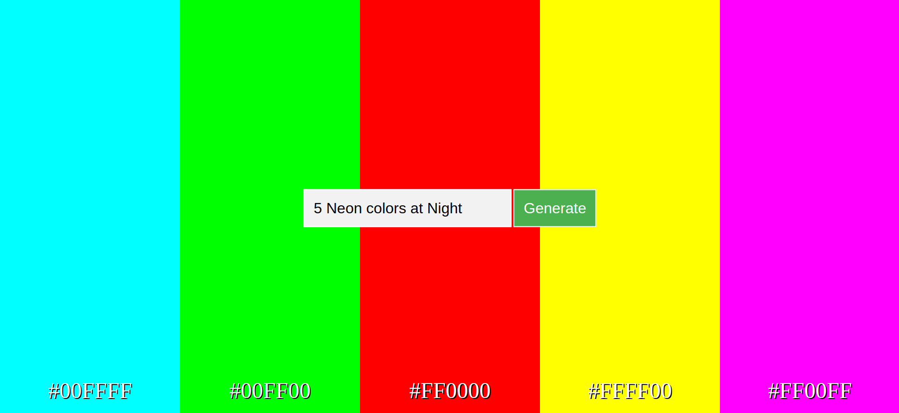
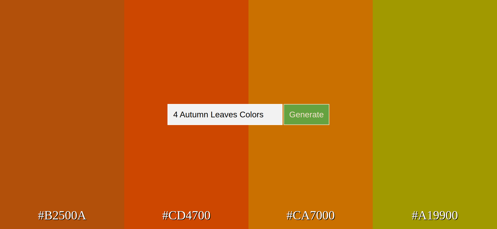

# Color Palette Generator

Color Palette Generator is a project that utilizes OpenAI's API and the Davinci-003 model to create a user-friendly web app for generating color palettes based on user prompts. It takes a verbal description of a color palette and returns a list of colors with their hexadecimal codes. Users can then view, copy, and utilize these colors for their own creative design projects.

## Table of Contents
- [Features](#features)
- [Technologies](#technologies)
- [What I Learned](#what-i-learned)
- [Setup and Installation](#setup-and-installation)
- [Usage](#usage)

## Features
* Generate creative color palettes based on user input
* Colors are generated using OpenAI's Davinci-003 model
* Display colors with their hexadecimal color codes
* Allow users to copy hexadecimal color codes to their clipboard

## Technologies
* Python
* Flask
* JavaScript
* HTML5
* CSS
* OpenAI's API (Davinci-003 / GPT-4)

## What I Learned
Throughout this project, I gained valuable experience in various aspects of web development and working with AI-powered APIs. Some key learnings include:

* **OpenAI's API**: I learned how to work with OpenAI's powerful API to generate creative content based on user inputs. The Davinci-003 model provided an excellent way to convert text prompts into color palettes. The model could also be easily adapted to work with GPT-3.5-Turbo and GPT-4.

* **Flask Web Development**: This project allowed me to develop my skills in creating Flask web applications from scratch. I became proficient in setting up the necessary routes, handling user input, and integrating external APIs.

* **Front-end development with HTML, CSS, and JavaScript**: I strengthened my front-end development skills by creating an interactive and responsive user interface. This involved designing the layout, styling elements, and implementing functionality using JavaScript.

* **Asynchronous API calls with JavaScript**: I learned how to perform asynchronous API calls in JavaScript using the Fetch API. This enabled me to create a seamless user experience by updating the UI without the need for page reloads.

* **Integration of Python, Flask, and JavaScript**: This project taught me how to effectively integrate Python, Flask, and JavaScript to create a cohesive and functional web application. I learned how to pass data between the back-end and front-end layers, ensuring smooth communication between different components.

By working on this project, I have expanded my knowledge in web development, AI integration, and creating user-friendly applications, making me more confident and well-equipped for future projects.

## Setup and Installation

1. Clone the repository:
*git clone https://github.com/vladarama/color-palette-generator.git*

2. Navigate to the project folder and create a virtual environment:
*cd color-palette-generator*
*python -m venv venv*

3. Activate the virtual environment:
*source venv/bin/activate #*

4. Install the required dependencies:
*pip install -r requirements.txt*

5. Create a `.env` file in the root directory and add your OpenAI API key:
*OPENAI_API_KEY=your_api_key_here*

6. Run the Flask app:
*flask run*

## Usage
1. Open a web browser and navigate to `http://127.0.0.1:5000/`
2. Enter a verbal description of a color palette into the text box
3. Click the "Generate" button
4. The generated colors and their hexadecimal codes will be displayed on the screen
5. Click on a color to copy its hexadecimal code on your clipboard
